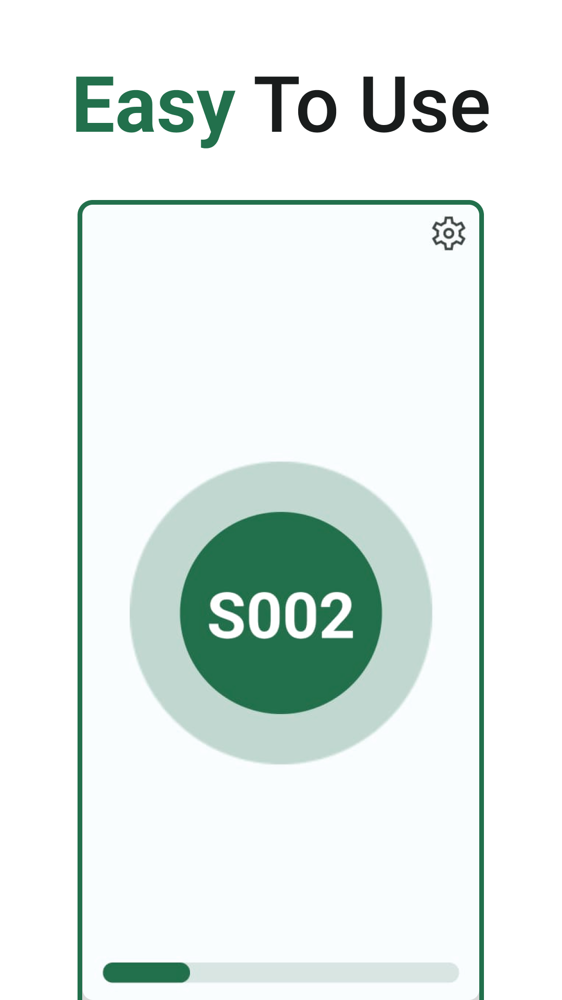
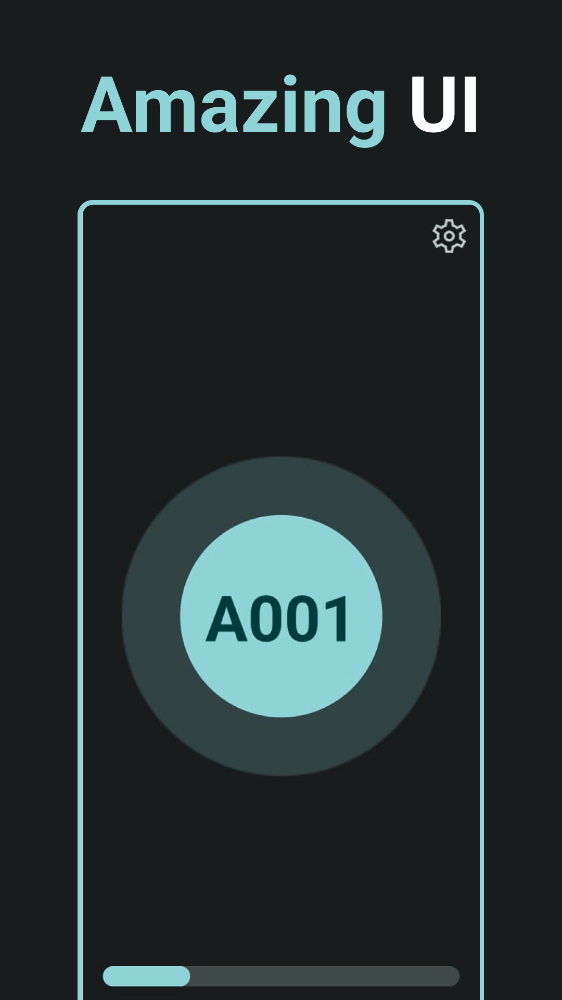
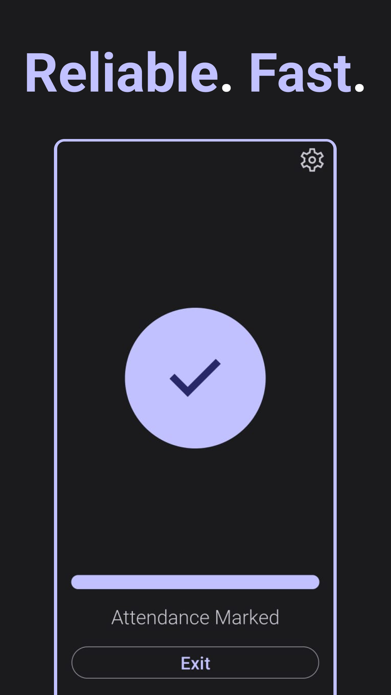
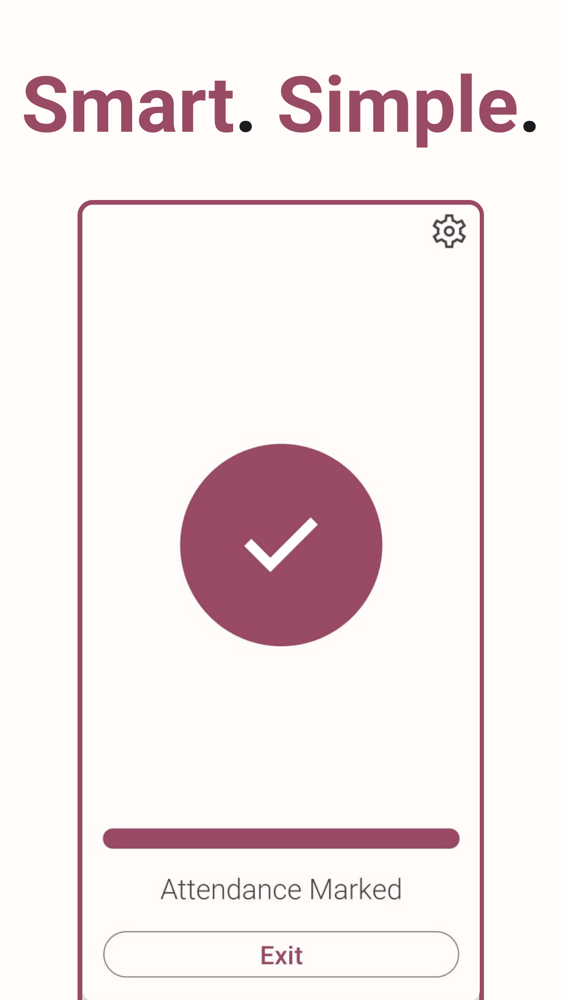

# Atten App
The Atten App is a mobile application that enables students to mark their attendance quickly and easily within a few seconds. 📱✅ The app uses Bluetooth and internet connectivity to automatically mark their attendance accordingly. This helps to save time and effort for both students and teachers. ⏰👩‍🏫 Students can also view their attendance score in the app. 📊

## Download
Atten is available on the [Google Play Store](https://play.google.com/store/apps/details?id=com.meet.atten) 🎉📥

## Features
✨ Quick and easy attendance marking using Bluetooth and internet connectivity.
📲 User-friendly interface for easy navigation.
🔒 Reliable attendance tracking system for accuracy and efficiency.
📊 Option for students to view attendance percentage.

### Installation
📥 Clone the repository to your local machine.
🔧 Open the project in Android Studio.
🚀 Build and run the app on your Android device.

### Usage
📱 Open the Attendance App on your mobile device.
📶 Turn on Bluetooth and Wi-Fi/mobile data.
✅ The app will automatically mark your attendance within seconds.

<!-- ### Screenshots
 
  -->

### Future Enhancements
🐛 Bug fixes and improvements.

### Contributing
🤝 We welcome contributions to the Atten App. If you have any suggestions or ideas for improvements, feel free to create a pull request or contact us.
